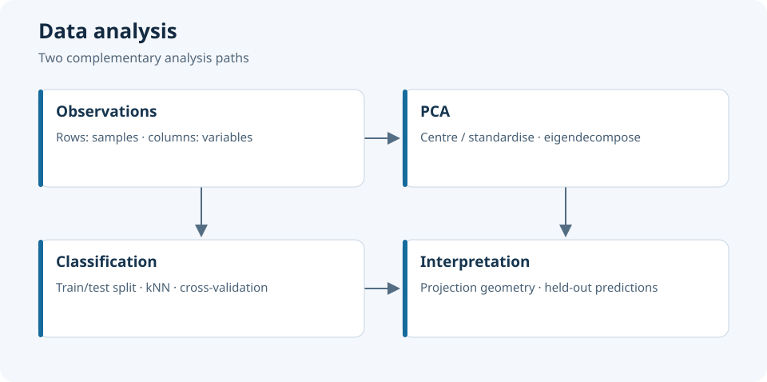

# Data Analysis — PCA and Introductory Machine Learning

MATLAB and Python exercises in PCA, classification and statistical data analysis.



*Two complementary analysis paths.*

## Project map

| Module | Technical focus | Files |
|---|---|---|
| [MATLAB PCA](ACP_MATLAB/) | Centring, standardisation, covariance and correlation matrices, eigendecomposition and projection | MATLAB scripts, data and working reports |
| [Python machine learning](Initiation_Machine_Learning_Python/) | Iris classification, train/test splitting, k-nearest neighbours and cross-validation | Standalone Python exercises |

## Engineering approach

PCA compares the geometry of raw and standardised variables: changing a variable's scale changes covariance-based components, whereas correlation-based PCA removes that unit dependence. Simulated Gaussian data provide a controlled example before an exploratory application to tabular data.

The classification exercises introduce the separation between fitting and evaluation. The neighbour count is a model parameter; cross-validation must use values compatible with the number of training samples in each fold.

## Getting started

Clone the repository and follow each module's README:

```bash
git clone https://github.com/tedjelmoulksn-dotcom/Analyse_de_Donnees.git
cd Analyse_de_Donnees
python -m venv .venv
source .venv/bin/activate
python -m pip install numpy matplotlib scikit-learn
```

Open the MATLAB scripts from their module directory so that relative data paths resolve correctly. Check the dataset filename before running the real-data PCA exercise.

## Reproducibility

Reproducibility rests on three choices: the variable scale used for PCA, the split used for supervised learning and the training-fold size used for parameter selection. Record these together with the script version so that comparisons refer to the same experiment.

The exercises make data preparation and evaluation choices visible. In particular, the cross-validation exercise overwrites its first split with an 80% test split, then sweeps neighbour counts beyond the training-fold size. Adjust that sweep before interpreting its results.

PCA describes the dominant variation in the selected variables. Classification evaluation addresses a different question: whether a trained decision rule generalises to observations excluded from fitting.

## Repository ownership and reuse

Academic work maintained by Tedj El Moulk Sinacer. Original reports retain their language and attribution. No project-wide licence has been defined.
